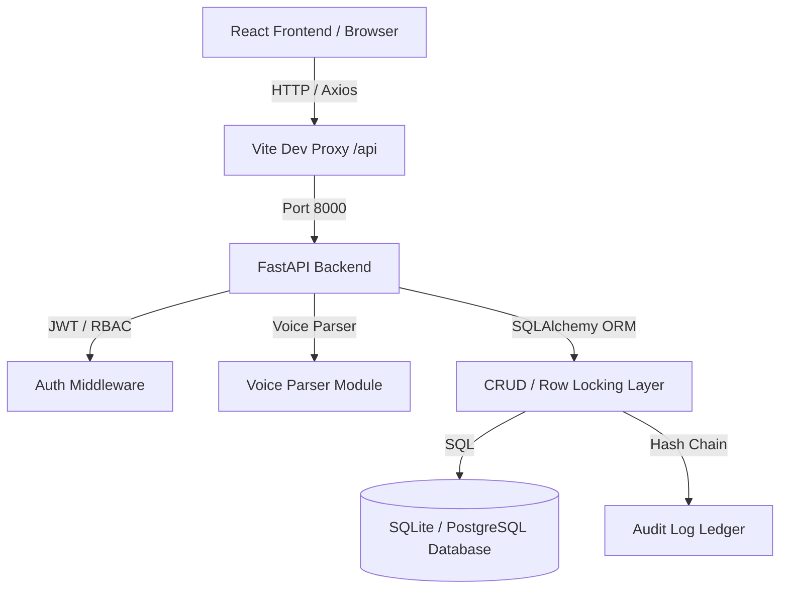

# Whitfield Fulfillment - Warehouse Management System (WMS)

A robust, multi-warehouse WMS designed for Reno, NV and Columbus, OH to replace error-prone spreadsheet operations.

---

## 1. Problem Statement

Using spreadsheets for warehouse inventory management introduces critical operation bottlenecks, data loss risks, and security issues:
* **Duplicate Stock Entries**: Laptop freezes or network hiccups cause workers to click "Submit" multiple times, double-counting incoming stock.
* **Race Conditions (Overselling)**: Two sellers confirm the same last unit of inventory at the exact same moment, leading to stock discrepancies and canceled orders.
* **Lack of Accountability**: No structured trace of who edited what, when, or why. Edits and deletions occur silently.
* **Insecure Access Control**: New hires have the same access level as veterans and admins, presenting high operational risks.
* **Inefficient Fulfillment Cycle**: Multiple manual steps lead to long fulfillment queues and slower turnaround.
* **Hands-Full Scanning**: Operators cannot easily type or scan items while carrying boxes, slowing down inbound receiving.

---

## 2. The Solution

This system replaces spreadsheets with a transactional, voice-enabled, secure database application:

| Spreadsheet Problem | Technical Solution in Whitfield WMS |
|---|---|
| **Duplicate Stock Entries** | **Idempotent API Transactions**: Every receipt carries a unique client-generated UUID (idempotency key). Replays return the cached response instead of writing a new row. |
| **Overselling / Race Conditions** | **Atomic Database Row Locking**: Employs row locks (`SELECT ... FOR UPDATE` on PostgreSQL, serialized transactions on SQLite) to reserve inventory atomically. |
| **Silently Modified Data** | **Hash-Chained Audit Logs**: An append-only audit trail where database updates and deletions are banned at the ORM layer. Each log entry is linked to the previous one via SHA-256 hashes. |
| **New Hire Access Risks** | **FastAPI Role-Based Security (RBAC)**: Fine-grained hierarchy checks (`NEWHIRE < VETERAN < ADMIN`) enforced as path dependencies on every route. |
| **Slow Fulfillment** | **Kanban Pipeline**: Track orders in real-time through a visual kanban board (`Received` -> `Pulling` -> `Packing` -> `Shipped`) with packing dimension captures. |
| **Hands-Full Scanning** | **Voice-Activated Receiving**: Real-time microphone capture with a heuristic voice parser ("log three cases of twelve...") to record stock hands-free. |

---

## 3. System Architecture

The WMS uses a decoupled, modern architecture:



### Backend Structure
- `backend/core/apis/routes`: API contracts and route controllers (FastAPI).
- `backend/core/controllers`: Core business logic layer.
- `backend/core/crud`: Database transaction handling and row-level locking.
- `backend/core/database`: DB connections, models, and demo seed data.
- `backend/core/modules`: NLP/voice parsing, routine integrity checkers, and AI assistant interface.
- `backend/commons`: Authentication (JWT + RBAC) and custom logging.

### Frontend Structure
- `frontend/src/context`: React Context for global state (Auth, Warehouse selections).
- `frontend/src/services`: Axios API client with automatic token attachment and idempotency key generators.
- `frontend/src/pages`: Interactive dashboard, voice terminal, kanban board, audit logs, and scripts runner.
- `frontend/src/components`: UI components (layout, buttons, modal windows).

---

## 4. How to Run Locally

### Prerequisites
- Python 3.12+
- Node.js v18+

### Backend Setup
1. Open a terminal in the `backend` folder:
   ```bash
   cd backend
   ```
2. Create and activate a virtual environment:
   ```bash
   python -m venv .venv
   # On Windows:
   .venv\Scripts\activate
   ```
3. Install dependencies:
   ```bash
   pip install -r requirements.txt
   ```
4. Run the development server:
   ```bash
   uvicorn main:app --reload --port 8000
   ```
   *API documentation will be available at [http://localhost:8000/docs](http://localhost:8000/docs).*

### Frontend Setup
1. Open another terminal in the `frontend` folder:
   ```bash
   cd frontend
   ```
2. Install package dependencies:
   ```bash
   npm install
   ```
3. Run the frontend application:
   ```bash
   npm run dev
   ```
   *The application will open at [http://localhost:5173](http://localhost:5173).*

### Default Login
- **Username**: `admin`
- **Password**: `Whitfield#2026`
- **Other Demo Users**: `dana.veteran` and `kai.newhire` (same password).
